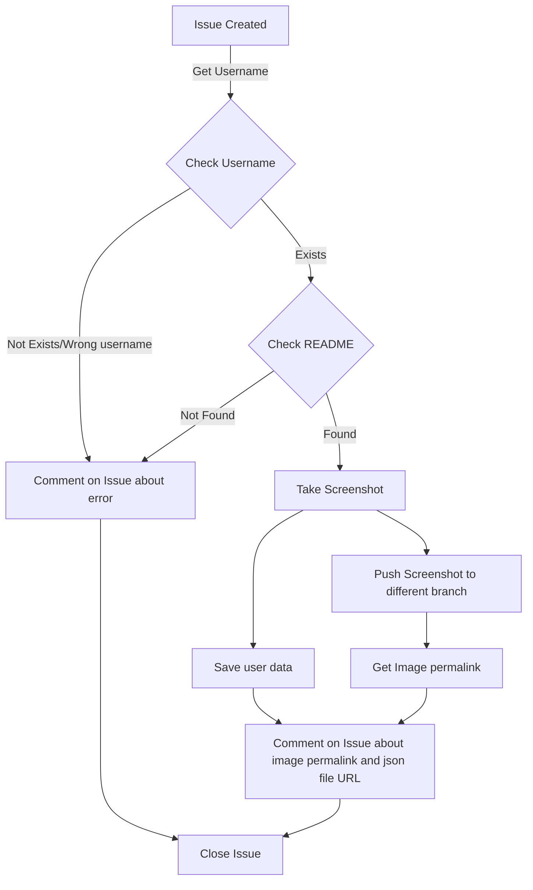

## Workflow

1. Get `username` from the issue
2. Check `Username`
3. Check profile `README.md`
4. Capture `README.md` screenshot
5. Save user data in a json file

## Basic Flow Chart

Learn more about creating this type of flow chart in [this github blog](https://github.blog/2022-02-14-include-diagrams-markdown-files-mermaid/)

## Storage Issue

One of the biggest issues with this workflow is that it is not possible to store all the README images in a single repository.

And our motive is to make this workflow as user-friendly as possible, so we can't ask users to take a screenshot of their profile README and add it to the issue.

### Solution

[We used github permalink to store the images](https://docs.github.com/en/repositories/working-with-files/using-files/getting-permanent-links-to-files)

- Upload Image to a different branch
- Get a permalink of the uploaded image
- Current image will be deleted on upload of the new image

So there can be a maximum 1 image available in the repo

Issue fixed :hugs:
